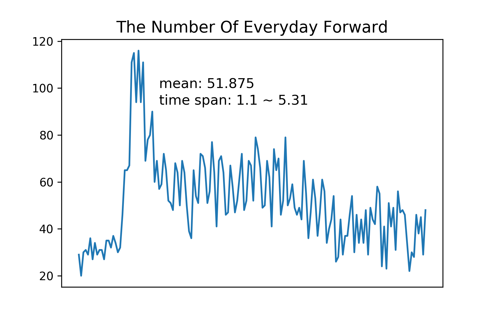
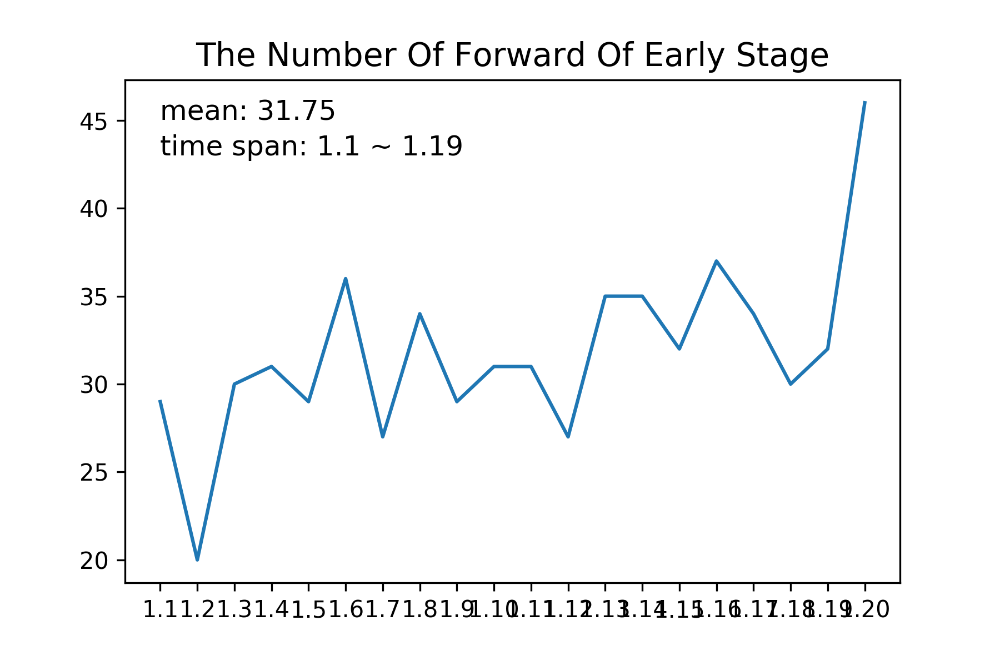
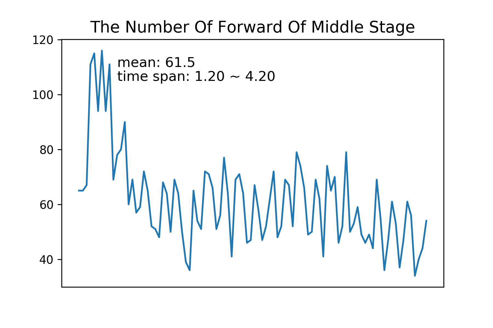
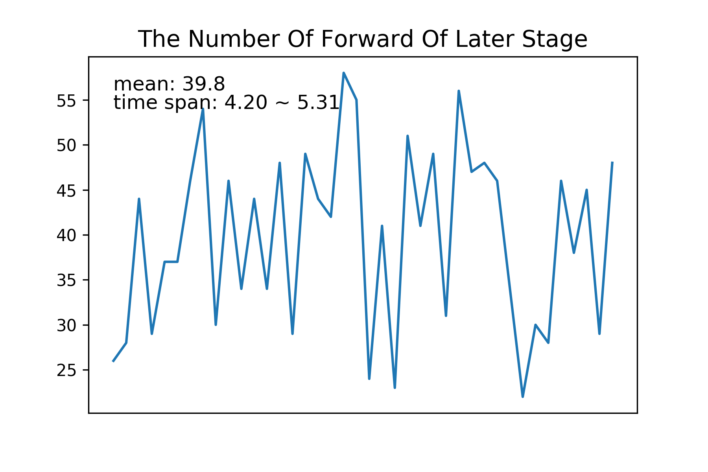

## 数据爬取过程


### 微博列表数据分析

1. 数据量统计

<table border=0 cellpadding=0 cellspacing=0 width=435 style='border-collapse:
 collapse;table-layout:fixed;width:325pt'>
 <col width=87 span=5 style='width:65pt'>
 <tr height=21 style='height:16.0pt'>
  <td height=21 width=87 style='height:16.0pt;width:65pt'></td>
  <td width=87 style='width:65pt'>forward</td>
  <td width=87 style='width:65pt'>comment</td>
  <td width=87 style='width:65pt'>like</td>
  <td width=87 style='width:65pt'>timeStamp</td>
 </tr>
 <tr height=21 style='height:16.0pt'>
  <td height=21 style='height:16.0pt'>count</td>
  <td align=right>7885</td>
  <td align=right>7885</td>
  <td align=right>7885</td>
  <td align=right>7885</td>
 </tr>
 <tr height=21 style='height:16.0pt'>
  <td height=21 style='height:16.0pt'>mean</td>
  <td align=right>9901.74534</td>
  <td align=right>3354.8577</td>
  <td align=right>52072.6529</td>
  <td align=right>1584050466</td>
 </tr>
 <tr height=21 style='height:16.0pt'>
  <td height=21 style='height:16.0pt'>std</td>
  <td align=right>262006.829</td>
  <td align=right>10707.3467</td>
  <td align=right>166692.254</td>
  <td align=right>3511551.7</td>
 </tr>
 <tr height=21 style='height:16.0pt'>
  <td height=21 style='height:16.0pt'>min</td>
  <td align=right>42</td>
  <td align=right>47</td>
  <td align=right>392</td>
  <td align=right>1577840100</td>
 </tr>
 <tr height=21 style='height:16.0pt'>
  <td height=21 class=xl63 align=right style='height:16.0pt'>25%</td>
  <td align=right>353</td>
  <td align=right>522</td>
  <td align=right>4091</td>
  <td align=right>1580912880</td>
 </tr>
 <tr height=21 style='height:16.0pt'>
  <td height=21 class=xl63 align=right style='height:16.0pt'>50%</td>
  <td align=right>736</td>
  <td align=right>1045</td>
  <td align=right>9422</td>
  <td align=right>1583843280</td>
 </tr>
 <tr height=21 style='height:16.0pt'>
  <td height=21 class=xl63 align=right style='height:16.0pt'>75%</td>
  <td align=right>1856</td>
  <td align=right>2554</td>
  <td align=right>30038</td>
  <td align=right>1586784960</td>
 </tr>
 <tr height=21 style='height:16.0pt'>
  <td height=21 style='height:16.0pt'>max</td>
  <td align=right>15460810</td>
  <td align=right>339350</td>
  <td align=right>3070305</td>
  <td align=right>1590940440</td>
 </tr>
 <![if supportMisalignedColumns]>
 <tr height=0 style='display:none'>
  <td width=87 style='width:65pt'></td>
  <td width=87 style='width:65pt'></td>
  <td width=87 style='width:65pt'></td>
  <td width=87 style='width:65pt'></td>
  <td width=87 style='width:65pt'></td>
 </tr>
 <![endif]>
</table>


结论：
总体来看，like $\gt$ comment $\approx$ forward，forward 数据的75%分位数以上的部分过大，存在异常值，导致平均值相应增大。

根据单sigma 原则，筛选出少量微博（17条）存在转发量远大于评论量与点赞量的微博：
```python
df[df["forward"] > 9901 + 262006].count()
# count: 17
```
去掉过多的数量后，forward 回归正常，这17条微博存在有意转发的现象。
```python
df[df["forward"] > 1856 + 262006]["forward"].sum()
# 异常值sum：54839705.0，占比 70%

int(int(int(7885 * 9901.75) - 54839705) / (7885 - 17))
# 去掉异常值后的forward 转发量平均值：2953，远低于之前的9901
```

明星效应的影响：与明星相关，微博含有明星名字的微博转发量超过平均值非常多。是否存在“虚假账户”（水军）（阴兵）？
```python
celebrity_forward_num = 808452 + 1352428 + 1128548 + 961410 + 1110738 + 1134405 + 1236141
# celebrity_forward_num = 7732122
celebrity_effect = 7732122 /(78069385 -(54839705.0 - 7732122))
#明星效应影响celebrity_effect = 24.97%
```


作图分析，like，comment，forward 的分布状况

1. 微博发布量变化趋势图










2. 微博话题的饼状图


3. 肺炎相关信息所占比重


4. 肺炎相关信息的关键词（武汉）


5. 微博话题变化趋势图


## 微博评论数据分析